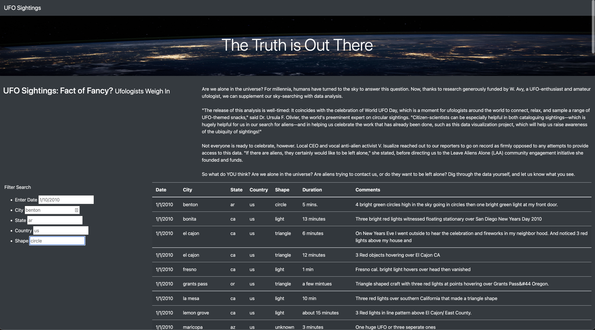
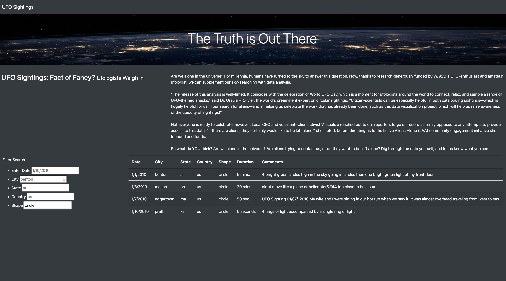

# UFOs

## Project Overview
**Purpose**: This project was to create a website with UFO sightings data for our client Daina. The key objective was to make the data accessible and easy to search through to potential users.

## Results
This website takes advantage of Data-Driven Documents (D3.js) for JavaScript to modulate the dataset based on the user's search criteria. D3 makes the website responsive to user inputs by "listening" to changes the user makes within the search filters. The user input is then stored as a value. Our functions are designed to extract the "key" from the user's corresponding value input (ie. if the user inputs "circle" in the "shape filter" then the value = circle and the key = shape). Our functions then identify and display the datasets that match the user provided key/value pairing(s). 

In the images below, you can see that initially the entire dataset is displayed on the website.

However, when the search parameter is switched to "circle" for the "shape" filter, only UFO sightings where the UFOs were described as a "circle" are displayed. 

## Summary
One drawback of the current webdesign is that the users **must** type in their input exactly as it appears in the dataset. For example, "circle" would be accepted, however, "Circle" would not be accepted. One solution for this issue would be to use the `.toLowerCase()` method to change the user's input to lowercase (which would then match the formating of the dataset). This should allow the input to be case insensitive.

In addition, there are some parameters in this dataset that are not currently searchable (such as duration and comments). Duration could easily be added using the existing framework we have developed. However, allowing for searches of the comments would be more complicated and we would likely need to take advantage of regular expressions to accomplish this.